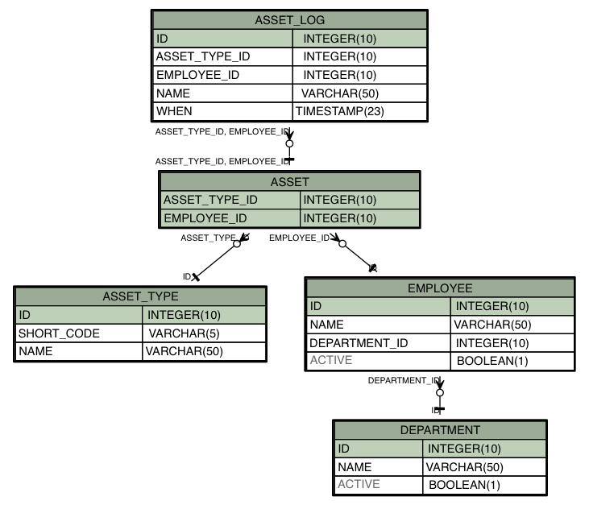

# schemadoc-8-example

A really simple example of generating a schema image off of a database all through a single maven pom file.  What makes this example cool is that:

- It uses an [H2](http://www.h2database.com) database that is packaged from dependencies,
- The database is setup using [liquibase](http://www.liquibase.org) from scratch, and
- Assuming that you have [Graphviz](http://www.graphviz.org) installed in your path with /bin/sh the following graphic image will be generated.
 

